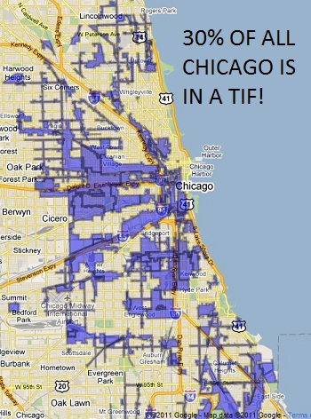
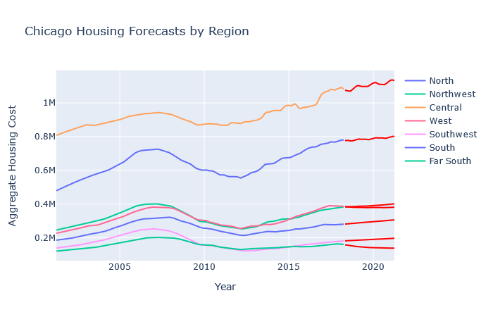

by Carly Tsuda, for the Flatiron School Data Science Program, Phase 4



### Business problem:
The controversial Tax Increment Financing program in the city of Chicago is undergoing an overhaul under newly-elected Chicago Mayor Lori Lightfoot. Lightfoot hopes to improve transparency and equity in the program and who it benefits. As part of this plan, she has established a Community Stakeholder team to oversee decisions about what districts are added to the program and which projects receive funding.

The first step this group has taken is to analyze the current status of housing prices in this city, and to forecast what they can expect for the future. The group wants to understand the property values and forecasts for each TIF region in the city to determine specific actions that the group can take to address the unique needs of each region.


### Data:
I'm using Zillow home value data from 1996 - 2018. The data represents aggregated home value for each zip code in the US, and also includes the city, county, larger metro area, and state for each zip code. It also includes a variable 'SizeRank'. This dataset was included as project data in the assignment, and might not be the most recent data available.

I also hand-coded Region data to best align the zip-code data with the TIF regions, and used a geolocator to calculate latitude and longitude for each zip code.

### Methods:
The final models, representing the data broken down by region, each do a fairly good job of predicting future property values with some degree of reliability. The time series for some regions were better suited for modeling than others, but overall the results were fairly reliable.

Each model used a SARIMAX algorithm with P, Q, R and P, Q, R s values of (1, 1, 1) x (1, 1, 1). Each forecast was set to predict 3 years into the future.

### Results:



| Region Name | AIC | P-Values | MSE | Slope |
|-|-|-|-|-|
| North | 2425 | All < 0.05 | 229830277.95 | 674 |
| Northwest | 2223 | All < 0.05 | 758391504.87 | 534 |
| Central | 2468 | ma and ma.S > 0.05 | 4128341244.86 | 1632 |
| West | 2333 | ar.S > 0.05 | 52323284.94 | -54 |
| Southwest | 2035 | < 0.05 | 166530296.16 | 424 |
| South | 2248 | ma.S > 0.05 | 27319322.0 | 713|
| Far South | 2036 | < 0.05 | 6196247.93 | -517 |

Overall, the AIC values of the regional time-series data were low, indicating a relatively good fit. For most of the models, each element of the SARIMAX model returned a p-value of less than 0.05, meaning we can reject the null hypothesis. For the models that did have higher p-values, they represented only one or two of the SARIMAX components, and were balanced out by other lower p-values. 

The MSE were relatively low across the models. It is difficult to compare the MSE between the individual regions, because there are fairly dramatic differences in aggregate home value between the regions. Perhaps the most disappointing metric of these models are the large confidence intervals. The larger areas of the confidence intervals indicate a substantial range for the predicted values, which does little to offer guidance about future home values, much less confidence in that guidance.


### Recomendations:


### For further information:
Please review the narrative of the analysis in [my jupyter notebook](./project4 - TIF District Forecasting.ipynb) and review [my non-technical presentation](./Forecast for Chicag's TIF Districts.pdf).

#### Repository structure:
```
├── README.md                       
├── project4 - TIF District Forecasting.ipynb            <- Jupyter Notebook presentation
├── Forecast for Chicag's TIF Districts.pdf              <- Non-technical presentation
├── Home Value Forecast in Chicago's TIF Districts.pdf   <- PDF of Jupyter Notebook
├── geocoded_data.csv                                    <- dataframe created in notebook using geocoder
└── img                                                  <- directory containing visualizations and images for presentation
    └── images    
└── data                                                  <- contains original dataset and data dictionary
